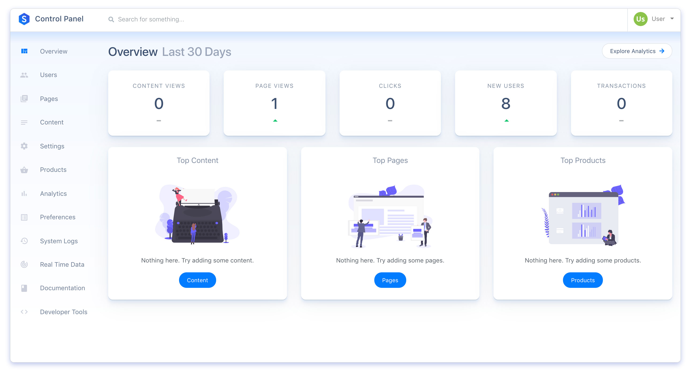

<h1>Startup Engine</h1>
A beautiful & open-source platform for launching startups. 
    

 

# Key Features 

* [x] Publish & sell software/content subscriptions.
* [x] Completely plug-and-play. Coding is optional.
* [x] Supports any workflow, architecture, or framework.
* [x] JSON API allows you integrate with external sites/apps.
* [x] Completely open-source.
* [x] 1-Click Install.

## Install Locally

### Standard Installation

See Laravel's [official installation guide](https://laravel.com/docs/5.6/installation) to get started with running Laravel apps locally.
 
Once you're familiar with Laravel, set up a a [PostgreSQL](https://www.postgresql.org/) database and run:

`composer install`  

To view your installation in a browser, run:

`php artisan serve`

Your app will be viewable at http://127.0.0.1:8000

The default user email is **admin@example.com** and the default password is **password**.

### Containerized Installation

Startup Engine ships with a complete Docker-powered development environment. To develop via Docker, run the following command inside the `/laradock` directory:

`docker-compose up -d nginx postgres php-worker laravel-horizon redis workspace`

Alternatively, you may use a PHP artisan command from the root directory to achieve the same effect:

`php artisan launch:Container` 

The app will be available locally athttp://startupengine.test. 

You may need to [edit your hosts file](https://www.imore.com/how-edit-your-macs-hosts-file-and-why-you-would-want) before the url will work.

# Deploying

Click the button below to deploy a new instance of Startup Engine to Heroku instantly.

Please reference Heroku's [official guide](https://devcenter.heroku.com/articles/getting-started-with-laravel) for getting started with Laravel apps on Heroku.

Once you've installed the [Heroku CLI](https://devcenter.heroku.com/articles/heroku-cli), run the following commands on your instance:

First, generate an `APP_KEY` by locally running: 

`php artisan key:generate`. 

Then copy the newly generated key and run:
 
`heroku config:set APP_KEY=APPKEYGOESHERE` 

The default user email is `admin@example.com` and the default password is `password`.

Change these after logging in.

# Support

Found a bug? [Submit an issue here on Github.](https://github.com/luckyrabbitllc/startupengine/issues)

# Security 

If you discover a security vulnerability within Startup Engine, please send an e-mail to startupengine.io@domainsbyproxy.com
 
All security vulnerabilities will be promptly addressed.

# License

Startup Engine is open-sourced software licensed under the [MIT license](http://opensource.org/licenses/MIT).