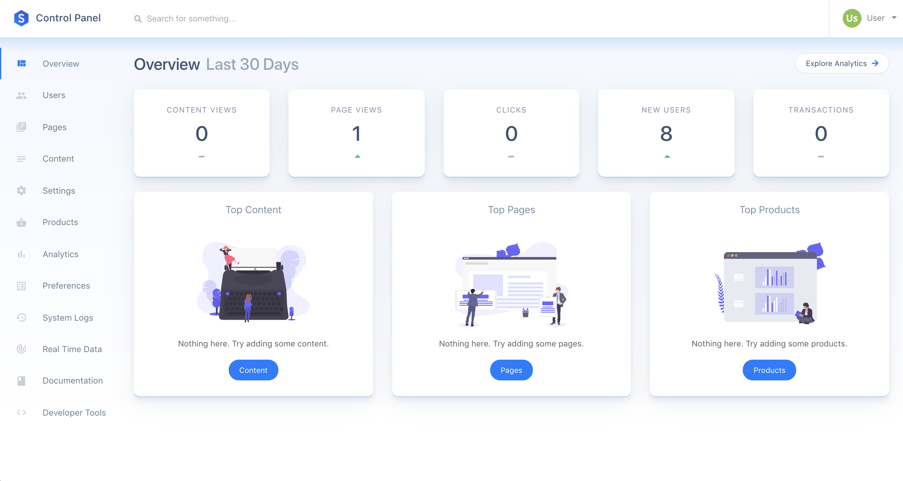

<h1>Startup Engine</h1>
A beautiful & open-source platform for launching startups. 
    

**Table of Contents** 

- [Screenshots](#screenshots)
- [Demo](#demo)
- [Features](#features)   
- [Deploying](#deploying)
- [Support](#support)
- [Security](#security)
- [License](#license)

 

# Demo

See it in action at https://www.startupengine.io

# Features 

* [x] Publish content, sell subscriptions & process payments.
* [x] Completely plug-and-play. Coding is optional.
* [x] Supports any workflow, architecture, or framework.
* [x] Content API allows you integrate with external sites/apps.
* [x] Landing pages optimization powered by integrated analytics. No setup required.
* [x] Completely open-source.
* [x] 1-Click Install.

# Deploying

## Deploy to Heroku

Click the button below to deploy a new instance of Startup Engine to Heroku instantly.

Please reference Heroku's [official guide](https://devcenter.heroku.com/articles/getting-started-with-laravel) for getting started with Laravel apps on Heroku.

Once you've installed the [Heroku CLI](https://devcenter.heroku.com/articles/heroku-cli), run the following commands on your instance:

First, generate an `APP_KEY` by running: 

`php artisan key:generate`. 

Then copy the newly generated key and run:
 
`heroku config:set APP_KEY=YOURKEYGOESHERE` 

`php artisan migrate:refresh --seed --force`

`php artisan passport:install`

`php artisan command:SyncGit reset`

You may log in by going to https://www.herokuapp.com/YOURAPPNAME/login

The default user email is **admin@example.com** and the default password is **password**.

Change these after logging in.

## Install Locally

See Laravel's [official installation guide](https://laravel.com/docs/5.6/installation) to get started with running Laravel apps locally.
 
Once you're familiar with Laravel, run

`composer install`

`npm install`

`php artisan key:generate`. 

Then copy the newly generated key and edit the value into your `.env` file. If you don't have an .env file, see `.env.example` for the required fields. 

Be sure you're running a [PostgreSQL](https://www.postgresql.org/) database, then run

`php artisan migrate:refresh --seed --force`

`php artisan passport:install`

`php artisan command:SyncGit reset`

And finally, to view your installation in a browser, run

`php artisan serve`

Your app will be viewable at http://127.0.0.1:8000

You may log in by going to http://127.0.0.1:8000/login

The default user email is **admin@example.com** and the default password is **password**.

# Support

Found a bug? [Submit an issue here on Github.](https://github.com/luckyrabbitllc/startupengine/issues)

# Security 

If you discover a security vulnerability within Startup Engine, please send an e-mail to startupengine.io@domainsbyproxy.com
 
All security vulnerabilities will be promptly addressed.

# License

Startup Engine is open-sourced software licensed under the [MIT license](http://opensource.org/licenses/MIT).